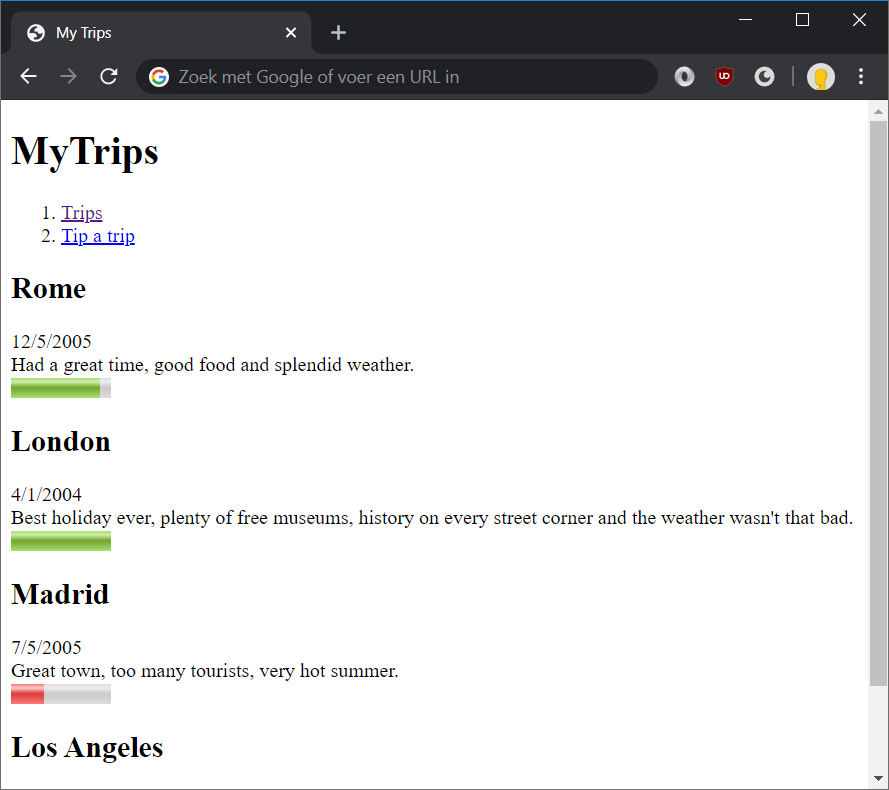
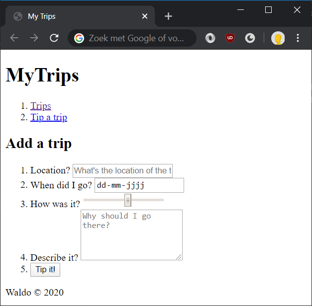

# Lab: Semantic elements



**The editor**

Our favorite editor for performing web development work is Visual Studio Code. It's a fast, feature-rich, free and open-source text editor. But feel free to choose something you're more comfortable with: WebStorm, Sublime, Atom, Visual Studio, whichever you might prefer.

In Visual Studio Code, use **File > Open Folder** to make a certain a directory your "project directory", which will make VS Code recognize certain configuration files (tslint, editorconfig, etc) as well as use all the files in that directory for giving autocompletion tips.

**Viewing your work**

Use any of the modern webbrowsers (Chrome, Firefox, Brave, Safari or Edge). Please **avoid** using Internet Explorer: it's slow, insecure and doesn't support modern web standards.

To view your progress, simply open Windows Explorer, navigate to an HTML file and double-click on it to view it in a browser. In the browser, you can hit the refresh button (F5) to view any changes you've made to the file.

## Exercise 1: basic structure

In this exercise you will create a web page that will allow the user to see a list of his vacation spots around the world. This page will be extended with more features in later exercises.

1. On your hard drive, create a new folder `trips`. Inside that new folder, create a new file named `index.html`.
1. Open `index.html` in your favorite browser by double-clicking the file. Also open the `trips` folder in your favorite editor.
1. In `index.html`, add a basic HTML structure: `DOCTYPE`, `<html>`, `<head>` and `<body>`.

	```html
	<!DOCTYPE html>
	<html>
	<head>
		<title>My Trips</title>
	</head>
	<body>
		
	</body>
	</html>
	```
1. Within `<body>`, add a few content elements:
   * a heading element showing `MyTrips`.
		```html
		<h1>MyTrips</h1>
		```
   * a `nav` element that holds all the navigation elements.
		```html
		<nav>
			<ol>
				<li><a href="index.html">Trips</a></li>
				...
			</ol>
		</nav>
		```
   * a `section` that holds `article`s which in turn hold the details of the trip. Use semantic elements there as well, like `meter` and `time`. We're adding the `id` and `class` attribute for styling in the next exercise.
		```html
		<section id="trips">
			<article class="trip">
				<header>
					<h2 class="city">Rome</h2>
					<time>12/5/2005</time>
				</header>
				...
			</article>
			...
		</section>
		```
   * a `footer` element for the copyright information.
		```html
		<footer>Waldo &copy; 2020</footer>
		```
    
Your HTML is now done! Your page should now look like this:


## Exercise 2: a form for adding trips

In this exercise, we'll be creating a second page for adding trips. It will not be functional yet, this exercise is all about building the form in HTML.



1. Copy `index.html` and rename the copy to `add-trip.html`
1. In `add-trip.html`, remove the `section` element with all of its content
1. Add a `main` element where the `section` used to be with a `form` inside of it.
	```html
	<main>
		<h2>Add a trip</h2>
		<form>

		</form>
	</main>
	```
1. Inside `form`, add an `ol` with a listitem for every `input` element
	```html
	<ol>
		<li>
			<label for="input-location">Where to?</label>
			<input id="input-location" placeholder="What&#039;s the location of the trip?">
		</li>
		...
	</ol>
	```

1. Add some form validation to the form:
	* **`input-location`** should become a required field with a minimum length of 3 and a maximum length of 30.
	* **`input-when`** should become a date input field. Use a regular expression with the field that ensures a date in the format of `dd-mm-yyyy`. Visualize this format as a placeholder for user-friendliness.
	* **`input-rating`** should be a slider where one can select a value between 0 and 10.
	* **`input-why`** should be kept optional.

	```html
	<input id="input-location" required minlength="3" maxlength="30">
	```
	```html
	<input type="date" id="input-when" required pattern="\d{1,2}-\d{1,2}-\d{4}" placeholder="dd-mm-yyyy">
	```

1. Finally, add a button to submit the form.
	```html
	<li><button>Add</button></li>
	```