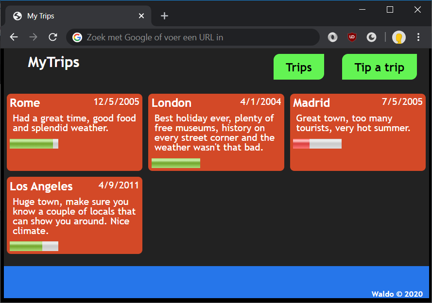
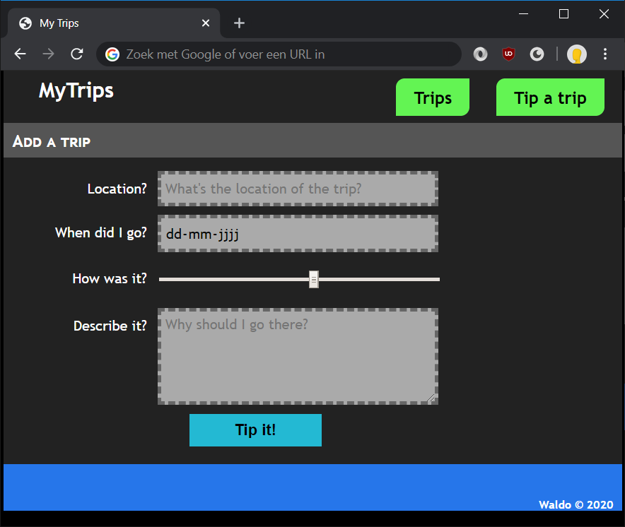

# Lab: CSS and flexible boxes

Our trips page is in need of styling. We will give it a lick of paint in this lab. We will also add a second page for adding more trips to the page.

## Exercise 1: adding a reset stylesheet

Before we do anything, let's add a reset css so our page styling will look the same in just all modern browsers.

1. Search the internet for "reset.css" or go directly to https://meyerweb.com/eric/tools/css/reset/
1. Copy the CSS from that page and place it in a new file `reset.css` in the `css` folder
1. Add it the to page:
	```html
	<head>
		<title>My Trips</title>
		<link rel="stylesheet" href="css/reset.css">
	```

## Exercise 2: the trips page



1. In the `css` folder, create a new file `default.css` and link it from the page
	```html
	<head>
		<title>My Trips</title>
		<link rel="stylesheet" href="css/reset.css">
		<link rel="stylesheet" href="css/default.css">
	```
1. Add some styling to make the page look like the picture above. A lot of it is basic CSS styling.
   * make the page dark
   * set the text color to silver
   * make the navigation items green
   * make headers white and a bit bigger in size
   * style the trips in terms of coloring
   * make the footer blue and align the text to the right side
   * When hovering the navigation items, a different background color should become active
1. For positioning the navigation items, we're gonna use flexible boxes.
	```css
	nav ol {
		display: flex;
		justify-content: flex-end;
	}
	```
1. Give the navigation items rounded edges. Also, during the hover, it might be nice for the background-color to transition into the new color. Let's also add a shadow, simply because we like shadows.
	```css
	nav a {
		...
		border-radius: 10px 0 10px 0;
		transition: 0.3s ease all;
	}
	nav a:hover {
		background-color: #1cb70b;
		box-shadow: 0 0 5px 3px lightgreen;
	}
	```
1. For aligning the trips, we'll be using flexible boxes again.
	```css
	#trips {
		display: flex;
		flex-wrap: wrap;
	}
	```
   By default, the amount of content is a large factor in determining the width of a trip. Let's set this manually.
   ```css
   .trip {
		padding: 5px;
		margin: 5px;
		width: calc(33.333333% - 10px - 10px);
		border-radius: 7px;
	}
   ```
1. Lastly, to align the city and the date next to each other, again we're gonna use flexible boxes.
	```css
	.trip header {
		display: flex;
		justify-content: space-between;
	}
	```

## Exercise 3: styling the add trips page



1. Let's start by styling the header. We're prefixing the selector with `main` as to not conflict with the `h2`s on the index page.
	```css
	main h2 {
		background: #555;
		padding: 10px;
		margin: 10px 0;
		font-weight: bold;
		font-size: 1.2em;
		font-variant: small-caps;
		color: white;
	}
	```
1. Now, for the form, let's start by adding some styling for the input fields:
	```css
	input,
	textarea {
		width: 300px;
		border: 4px dashed #666;
		background-color: #aaa;
		padding: 5px;
		font-family: "Trebuchet MS", sans-serif;
		font-size: 1em;
		outline: none;
	}
	```

1. Next, line up the labels up next to the input fields, using flexible boxes of course.
	```css
	form li {
		display: flex;
		padding: 5px 10px;
	}
	form label {
		text-align: right;
		width: 140px;
		padding: 12px;
		color: white;
	}
	```
1. And finally, style the submit button.

Our "Add trip" page should now be styled beautifully!
