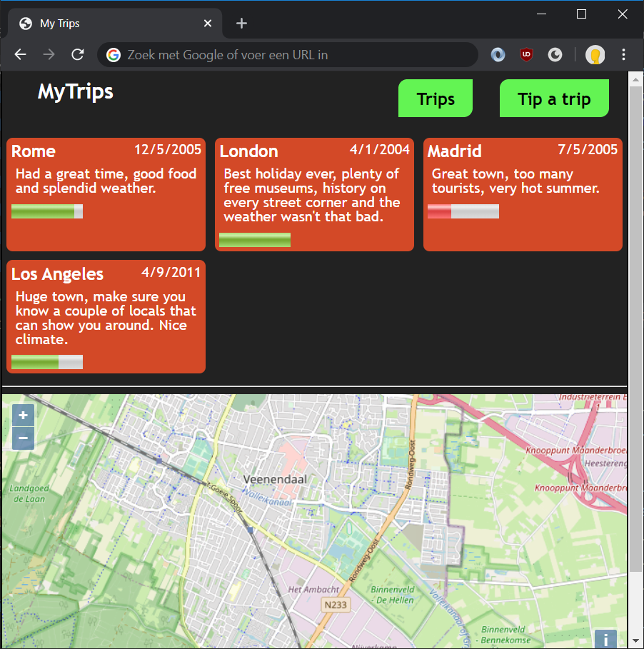

# Lab: You are here

In this exercise you will use the **Geolocation API** to determine the coordinates (latitude and longitude) of the current location of the user.



To plot this data on a map there are many options. In this exercise we choose to use the **Open Layers API** which is based upon Open Street Map. Up-to-date documentation on this API can be found here:

https://openlayers.org/en/latest/doc/quickstart.html

1. In `index.html`, just above the footer, add a `<div>` element for the map to load in:
    ```html
    <hr>
    <div id="map"></div>

    <footer>Waldo &copy; 2020</footer>
    ```
1. In your CSS file, give the map some height:
	```css
	#map {
		height: 300px;
	}
	```
1. Include Open Street Map's CSS and JavaScript in `index.html`:
    ```html
    <head>
		<title>My Trips</title>
		<link rel="stylesheet" href="https://openlayers.org/en/v5.0.0/css/ol.css">
		<script src="https://openlayers.org/en/v5.0.0/build/ol.js"></script>
    </head>
    ```
1. In `script/trips.js`, add a function `displayLocation()` that determines the current location of the user.

    ```js
    function displayLocation() {
		navigator.geolocation.getCurrentPosition(success, failure);

		function success(position) {

		}
		function failure(error) {
		
		}
	}
    ```

1. Implement `failure` by showing a notification message to the user. Use the `error` parameter to determine what went wrong. You can use HTML5's `hidden` attribute to show/hide a notification message.
1. Implement `success` by showing the map focusing on our coordinates. [Reading the documentation](https://openlayers.org/en/latest/doc/quickstart.html), we have to call `new ol.Map()`.
    ```js
    function success(position) {
		let { latitude: lat, longitude: long } = position.coords;

		let map = new ol.Map({
			target: 'map',
			layers: [
				new ol.layer.Tile({ source: new ol.source.OSM() })
			],
			view: new ol.View({
				center: ol.proj.fromLonLat([long, lat]),
				zoom: 13
			})
		});
    }
    ```
1. Finally, call `displayLocation()` from `index.html`.

    ```html
	<script>
		loadTrips();
		displayLocation();
	</script>
    ```

When viewing the page, your permission should be asked for sharing your location with the website. When granting this permission, a map should be shown with a fairly accurate pinpointed location. When denying this permission, a notification message should be shown.